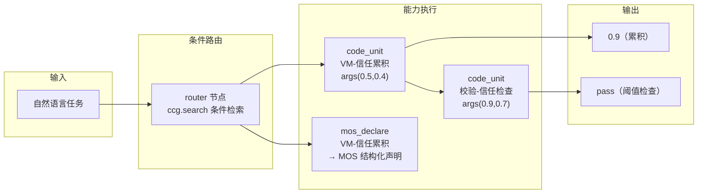

# 白箱能力工作流图（whitebox_capability_graph.md）

> 白箱所有能力知识图谱化、工作流化（仿 ComfyUI）——代码只是能力的一个方向。
> 引擎：`tools/whitebox_workflow.py`（node{class_type, inputs} + 边 + 拓扑执行）

## 核心工作流（路由 → 代码单元 → MOS 声明 → 组合执行）



**实际执行**（`docs/whitebox_capability_graph_demo.json`）：
```
顺序: n1(router) → n2(累积) → n3(MOS) → n4(检查)
n1 路由: [VM-信任累积, 校验-信任检查]   # 条件检索
n2 累积(0.5,0.4) → 0.9                # 代码单元执行
n3 MOS 声明: VM-信任累积               # 元操作声明
n4 检查(0.9,0.7) → pass               # 组合执行
```

## 节点类型

| class_type | 能力 | 说明 |
|---|---|---|
| `router` | 条件路由 | ccg.search 检索 → 命中单元 |
| `code_unit` | 代码单元 | 681 单元 pattern 执行首个函数 |
| `mos_declare` | 元操作声明 | 四要素注释 → MOS 结构化声明 |
| `pass` | 透传 | 值节点/数据流边 |

## 能力图谱（节点+边）

```
白箱能力图 = 节点（能力：代码单元/路由/MOS/知识/工具）
            + 边（依赖/组合/同义/数据流）
            + 工作流（JSON 保存/加载/复用——可移植共享）
```

- **路由置信度**（DaoTi coherence 吸纳）：ACCEPT 含连续置信度 [0,1]，低置信可降级
- **技能条件路由**（anthropics/skills + gliding_horse SkillLink 吸纳）：技能声明适用/不适用条件 + 关系边
- **自迭代八步闭环**：感知→识别→分析→验证→固化→记录→反馈→方向性自检（含理论完整性自指检查）
